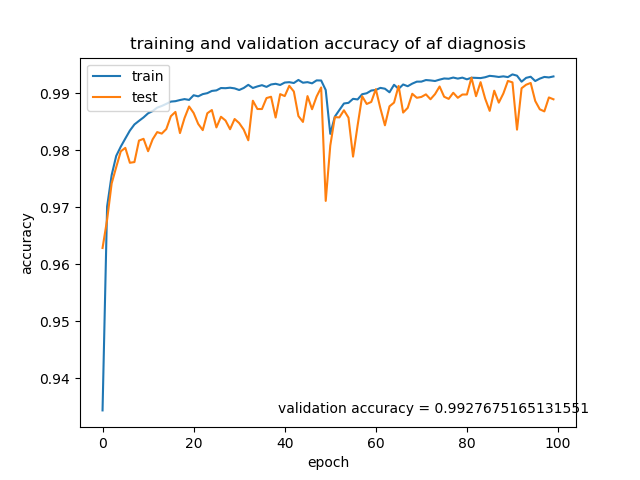
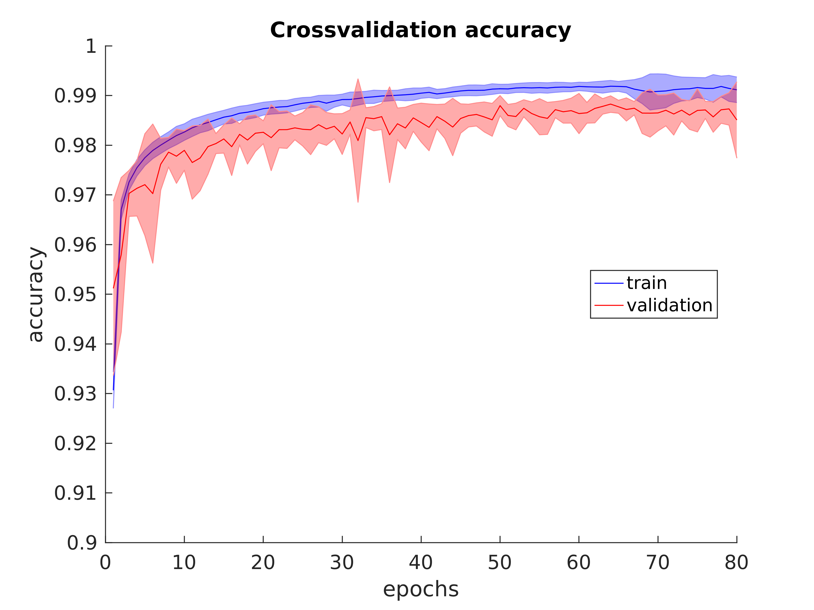
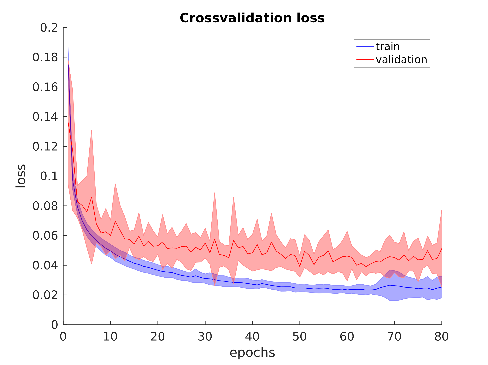

## Detecting Atrial Fibrillation from heart rate data using deep learning

This is the code repository to go along with the paper:

"Automated detection of atrial fibrillation using long short-term memory network with RR interval signals"

https://www.sciencedirect.com/science/article/pii/S0010482518301847

#### TLDR

I have trained a bidirectional LSTM model on the atrial fibrillation data sequences extracted from the physionet database to 99.3% accuracy (see Figure 1 below).

  

This is a fantastic result and very promising. My model looks like:

~~~python
# create a bidirectional lstm model (based around the model in:
# https://www.kaggle.com/jhoward/improved-lstm-baseline-glove-dropout
# )
inp = Input(shape=(n_timesteps,1,))
x = Bidirectional(LSTM(200, 
                       return_sequences=True, 
                       dropout=0.1, recurrent_dropout=0.1))(inp)
x = GlobalMaxPool1D()(x)
x = Dense(50, activation="relu")(x)
x = Dropout(0.1)(x)
x = Dense(1, activation='sigmoid')(x)
model = Model(inputs=inp, outputs=x)

~~~

#### More details ...

I also evaluated the model using both stratified 10-fold cross-validation and blind-fold validation (using completely held out patient data). Stratified 10-fold cross-validation produced the average accuracy and loss plots shown below:

  
  

And we achieved a mean AUC of 0.9986 from the 10-fold cross-validation process.

Blind-fold validation performed even better (almost certainly due to the smaller held out data set used in the blind-fold validation process).

#### Data?

I have provided the processed data sequences (in csv format) as a zip file in the data directory of this repository.

Data is in 100 beat sequences with a 99 beat overlap.  The first element of every row in the data file specifies how many beats in each sequence were annotated as exhibiting signs of atrial fibrillation.

To recreate the datasets used in the paper just extract the zip file somewhere, fix the directory in the code, and run the data exploration scripts in the data directory.  As an added bonus you should get some nice plots too! :)

#### Citation:

@article{deep_af_detection_2018,
title = "Automated detection of atrial fibrillation using long short-term memory network with RR interval signals",
journal = "Computers in Biology and Medicine",
year = "2018",
issn = "0010-4825",
doi = "https://doi.org/10.1016/j.compbiomed.2018.07.001",
author = "Oliver Faust and Alex Shenfield and Murtadha Kareem and Tan Ru San and Hamido Fujita and U. Rajendra Acharya"
}
